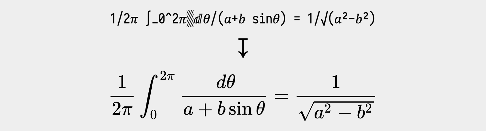
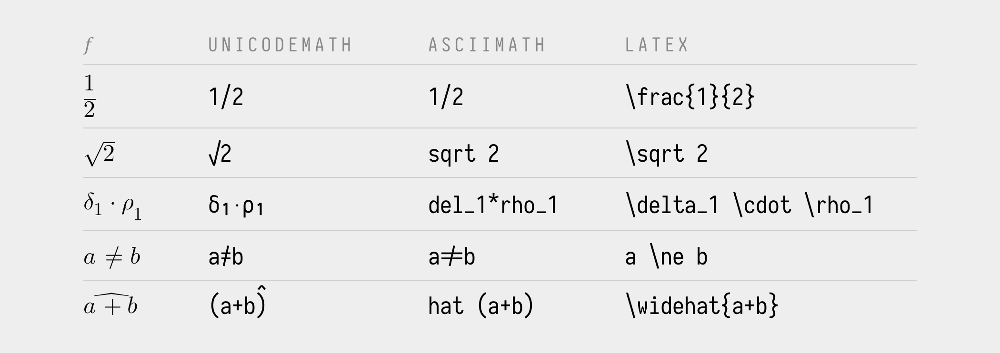
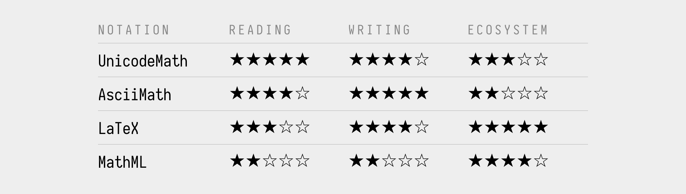
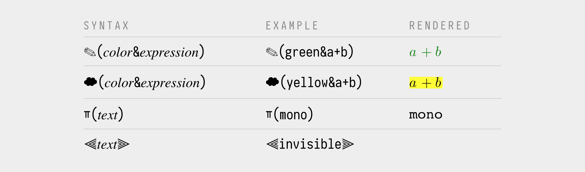
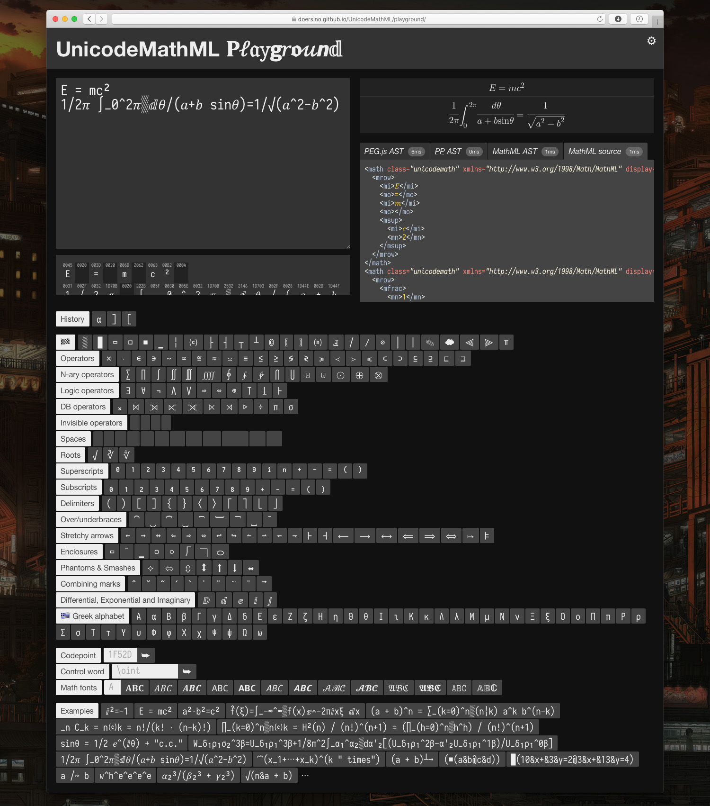
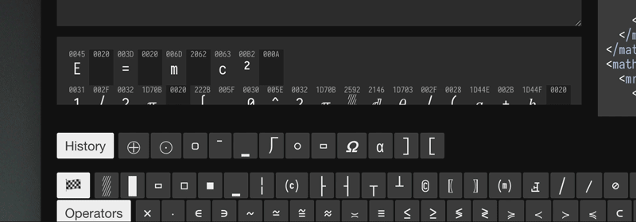

# UnicodeMathML

*This is a fork of Noah Doersing's UnicodeMathML repository with added commits by Murray Sargent III. The changes are summarized at the end of this document. To see the changed code, look at the main branch (https://github.com/MurrayIII/UnicodeMathML/tree/main), not the master branch.*

*This repository provides a JavaScript-based translation of [UnicodeMath](https://www.unicode.org/notes/tn28/) to [MathML](https://developer.mozilla.org/en-US/docs/Web/MathML) (hence "UnicodeMathML"). An interactive "playground" allows for experimentation with UnicodeMath's syntax and insight into the translation pipeline. UnicodeMathML can be easily integrated into arbitrary HTML or [Markdeep](https://casual-effects.com/markdeep/) documents.*

#### 🎮 Get familiar with the syntax via [the playground](https://MurrayIII.github.io/UnicodeMathML/playground/)!

#### 📑 [Learn how to](#getting-started) integrate UnicodeMathML into your website or Markdeep document.

UnicodeMath is an **easy-to-read linear format** for mathematics initially developed as an input method and interchange representation for Microsoft Office. Its author, Murray Sargent III, has published a [*Unicode Technical Note*](https://www.unicode.org/notes/tn28/) detailing the format, based on which this UnicodeMath to MathML translator was built. *More in the FAQ section below.*



*The initial development of UnicodeMathML was part of [my Master's thesis](docs/doersing-unicodemath-to-mathml.pdf).*


### Status

Generally consistent with version 3.1 of Sargent's tech note, some edge cases that aren't unambiguously specified (or, as UnicodeMath is not wholly context-free, impossible to parse with a PEG-based approach) might differ from the canonical implementation in Microsoft Office. Abstract boxes are largely unimplemented due to insufficient specification.


## Getting Started

For a **first look**, check out...

* ...the [UnicodeMathML playground](https://MurrayIII.github.io/UnicodeMathML/playground/), an interactive environment that allows you to play around with UnicodeMath's syntax and its translation into MathML.
* ...an [example Markdeep document](https://doersino.github.io/UnicodeMathML/src/integration/example.md.html) whose source can be found [here](https://github.com/doersino/UnicodeMathML/blob/master/src/integration/example.md.html).
* ...or an [example HTML document](https://doersino.github.io/UnicodeMathML/src/integration/example.html) whose source is located [here](https://github.com/doersino/UnicodeMathML/blob/master/src/integration/example.html).

Depending on whether you'd like to write UnicodeMath in a Markdeep document or use UnicodeMathML on your website, there are two paths. But first:

1. **Clone this repository** or [download a ZIP](https://github.com/doersino/UnicodeMathML/archive/master.zip).

    ```bash
    git clone https://github.com/doersino/UnicodeMathML.git
    ```

2. Before moving on, note that UnicodeMathML by default only transforms **math surrounded by the UnicodeMath delimiters `⁅` and `⁆`**. For example, a [typical sentence](https://en.m.wikipedia.org/wiki/Integral) might read like this:

    ```markdown
    Given a function ⁅f⁆ of a real variable ⁅x⁆ and an interval ⁅[a, b]⁆ of the real line, the **definite integral**

    ⁅∫_a^b f(x) ⅆx⁆

    can be interpreted informally as the signed area of the region in the ⁅xy⁆-plane that is bounded by the graph of ⁅f⁆, the ⁅x⁆-axis and the vertical lines ⁅x = a⁆ and ⁅x = b⁆.
    ```

### HTML

Open `dist/example.html` in a text editor of your choice and scroll to the bottom. There, you'll see the following lines:

```html
<script>
    var unicodemathmlOptions = {
        resolveControlWords: true,
    };
</script>
<script src="unicodemathml.js"></script>
<script src="unicodemathml-parser.js"></script>
<script src="unicodemathml-integration.js"></script>
<script>
    document.body.onload = renderUnicodemath();
</script>
```

You'll need to **include the same lines (modulo path changes) at the bottom of your own HTML document** or website (but *before* the closing `</body>` tag).

* Of course, you can use [webpack](https://webpack.js.org) or similar tools to combine and minify the JavaScript files, which I definitely recommend if you're planning on using UnicodeMathML in even moderate-traffic production contexts: *This will shrink them from ~500 kB down to ~150 kB, and gzipping can reduce this further to ~50 kB.*
* If you need to support [browsers that don't support MathML natively](https://caniuse.com/#search=mathml), you will also need to load a polyfill like [MathJax](https://www.mathjax.org) – UnicodeMathML will notify MathJax when the generated MathML is ready to render.
* The `unicodemathmlOptions` variable allows you to tweak things a bit – see the "Configuration" section below for more details.

### Markdeep

UnicodeMathML comes with a lightly modified variant of Morgan McGuire's [Markdeep](https://casual-effects.com/markdeep/) that kicks off the translation at the correct point in the document rendering process. Open `dist/example.md.html` in a text editor of your choice and scroll to the bottom. There, you'll see the following lines:

```html
<script>
    var unicodemathmlOptions = {
        resolveControlWords: true,
    };
</script>
<script src="unicodemathml.js"></script>
<script src="unicodemathml-parser.js"></script>
<script src="unicodemathml-integration.js"></script>
<script src="markdeep-1.11.js" charset="utf-8"></script>
```

Replace the Markdeep loading code at the bottom of your document with this code (modulo path changes).

* Markdeep will automatically load [MathJax](https://www.mathjax.org), a polyfill that will allow [browsers that don't support MathML natively](https://caniuse.com/#search=mathml) to render the generate MathML.
* The `unicodemathmlOptions` variable allows you to tweak things a bit – see the "Configuration" section below for more details.


### Node

While I haven't tested server-side translation of UnicodeMath into MathML, there shouldn't be any problems integrating the core of UnicodeMathML into a Node project – it's all vanilla JavaScript. If you run into any trouble, or if you would prefer an officially supported NPM package or something, don't hesitate to [file an issue](https://github.com/doersino/UnicodeMathML/issues)!


### Configuration

The `unicodemathmlOptions` variable must be a **dictionary containing one or many of the key-value pairs described below**. If you're happy with the defaults, you can leave `unicodemathmlOptions` undefined.

```js
var unicodemathmlOptions = {

    // whether a progress meter should be shown in the bottom right of the
    // viewport during translation (you can probably disable this in most cases,
    // but it should remain enabled for large documents containing more than
    // 1000 UnicodeMath expressions where translation might take more than a
    // second or two)
    showProgress: true,

    // whether to resolve control words like "\alpha" to "α", this also includes
    // unicode escapes like "\u1234"
    resolveControlWords: false,

    // a dictionary defining a number of custom control words, e.g.:
    // customControlWords: {'playground': '𝐏𝓁𝔞𝚢𝗴𝑟𝖔𝓊𝙣𝕕'},
    // which would make the control word "\playground" available – this is handy
    // in documents where certain expressions or subexpressions are repeated
    // frequently
    customControlWords: undefined,

    // how to display double-struck symbols (which signify differentials,
    // imaginary numbers, etc.; see section 3.11 of the tech note):
    // "us-tech" (ⅆ ↦ 𝑑), "us-patent" (ⅆ ↦ ⅆ), or "euro-tech" (ⅆ ↦ d)
    doubleStruckMode: "us-tech",

    // a function that will run before the translation is kicked off
    before: Function.prototype,

    // a function that will run after the translation has finished (and after
    // MathJax, if loaded, has been told to render the generated MathML)
    after: Function.prototype
};
```


## FAQ

Got **further questions** that aren't answered below, or ideas for **potential improvements**, or **found a bug**? *Feel free to [file an issue](https://github.com/doersino/UnicodeMathML/issues)!*


### What's this *UnicodeMath* you're talking about?

UnicodeMath is a **linear format for mathematics** initially developed as an [input method](https://www.youtube.com/watch?v=yyvJwNeUALY) and interchange representation for Microsoft Office. Its author, Murray Sargent III, has published a [*Unicode Technical Note*](https://www.unicode.org/notes/tn28/) (a copy of which is included at `docs/sargent-unicodemathml-tech-note.pdf`) describing its syntax and semantics.

By using Unicode symbols in lieu of keywords wherever possible, it's significantly more readable than, say, LaTeX in plain text:


UnicodeMath, much like MathML, was [desiged with accessibility in mind](https://www.unicodeconference.org/presentations/S9T1-Sargent.pdf), taking cues from [Nemeth braille](https://www.nfb.org/images/nfb/documents/pdf/nemeth_1972.pdf) and other preceding math encodings.


### How does its syntax compare to [AsciiMath](http://asciimath.org), (La)TeX, and MathML?

Here's a table showing a few expressions as you'd formulate them in UnicodeMath, AsciiMath, and LaTeX:



There are many subtleties as you get into the nitty-gritty, of course, but you'll see that **UnicodeMath consistently makes for the most readable and concise plaintext**. LaTeX, in contrast, is significantly more verbose – but since it's been around forever, you might find it to be more versatile in practice.

To summarize, here's a **totally-not-biased-and-super-scientific evaluation of these notations**:




### Does UnicodeMath support colors, monospaced text and comments?

Not in its canonical form as described in Sargent's tech note – in Section 1, he mentions that such properties should be delegated to a "higher layer", which is perfectly reasonable in GUI-based environments like Microsoft Office – but there is not such layer in HTML/Markdeep.

***Update:* In late 2021, Murray Sargent [adopted part of the notation described below into mainline UnicodeMathML](https://devblogs.microsoft.com/math-in-office/unicodemath-color/); this fix was published as part of [UnicodeMath version 3.2](https://www.unicode.org/notes/tn28/UTN28-PlainTextMath-v3.2.pdf).**
**

To remedy this, **UnicodeMathML introduces a few non-standard constructs**:



For your copy-and-pasting pleasure, that's `✎`, `☁`, `ￗ`, `⫷`, and `⫸`. You can use any color name or specification [supported](https://developer.mozilla.org/en-US/docs/Web/CSS/color_value) by CSS.


### Cool, but I can't find any of these fancy Unicode symbols on my keyboard!

Nobody's keeping you from adapting [Tom Scott's emoji keyboard](https://www.youtube.com/watch?v=lIFE7h3m40U) idea for math.

More realistically, there's a bunch of **tooling and text editor plugins** that can help out here:

* There's a [Sublime Text plugin](https://github.com/mvoidex/UnicodeMath) (called UnicodeMath, curiously) that helps with inserting Unicode math symbols.
* A port of this plugin is [available for VS Code](https://marketplace.visualstudio.com/items?itemName=GuidoTapia2.unicode-math-vscode).
* The emoji picker built into macOS (press <kbd>ctrl</kbd>+<kbd>⌘</kbd> to open it when in a text input context) supports insertion of many Unicode math symbols as long as you know part of their canonical name.
* Other editors and operating systems probably have similar functionality – give the search engine of your choice a workout.

Additionally, you can configure UnicodeMathML to automatically translate keywords like `\infty` into their respective symbols before processing proper commences – see the "Configuration" section above.


### Alright, that's not as big of a problem as I feared. What's *MathML*, then?

You could describe MathML as **"HTML, but for math"**. It's an XML-based markup language for mathematical expressions that was first released as a W3C recommendation [in 1998](https://www.w3.org/1999/07/REC-MathML-19990707/toc.html) – it's been around for a while!

Einstein's famous `E=mc²` can be expressed as follows:

```html
<math xmlns="http://www.w3.org/1998/Math/MathML" display="block">
  <mrow>
    <mi>E</mi>      <!-- identifier -->
    <mo>=</mo>      <!-- operator -->
    <mrow>          <!-- grouping, similat to <span> in HTML -->
      <mi>m</mi>
      <msup>        <!-- superscript -->
        <mi>c</mi>
        <mn>2</mn>  <!-- number -->
      </msup>
    </mrow>
  </mrow>
</math>
```

UnicodeMath's Sargent [notes](docs/sargent-unicodemathml-tech-note.pdf): "MathML has been designed for machine representation of mathematics and is useful for interchange between mathematical applications as well as for rendering the math in technical documents. While very good for these purposes, MathML is awkward for direct human input. Hence it's desirable to have more user friendly ways of inputting mathematical expressions and equations."


### Isn't browser support for MathML really lackluster?

Sort of – according to [caniuse.com](https://caniuse.com/#search=mathml), native support for MathML is available for around 21% of users as of late 2020** since only Firefox and Safari supported MathML.

However, [Igalia](https://mathml.igalia.com) added MathML rendering support to Chromium and as of Spring 2023, MathML support has arrived in Chrome, Edge, and Opera, reaching a total of 90% of users. To see how it looks with your browser, click [here](https://murrayiii.github.io/UnicodeMathML/dist/example.html).

All of this isn't really an issue: [MathJax](https://www.mathjax.org), which you'd probably use to render LaTeX math on the web anyway, provides a polyfill for MathML rendering.


### But LaTeX seems much more established in various workflows than MathML, and [KaTeX](https://katex.org) is so much faster than MathJax!

Can't argue with that! Which is why I've been experimenting with extending UnicodeMathML to emit LaTeX code, too – most but not all UnicodeMath features are supported at a basic level. You can take a look at the current state of this feature in the playground by enabling the "Enable EXPERIMENTAL LaTeX output" setting.

*I'm not actively working on completing LaTeX code generation at the moment, but feel free to [file an issue](https://github.com/doersino/UnicodeMathML/issues) if this feature is important to you.*

### Tell me more about the playground.

Sure thing – I've originally built it as a parser development aid. Before learning about it in detail, take a gander at this **screenshot of its interface**:



* In the top right corner, there's a gear icon. Hover over it to access the settings – you can **toggle various options on or off**, including a debug mode and experimental LaTeX code generation.
* The text field on the left is where you'd **enter your UnicodeMath expressions**.
* In the expanding-on-hover section below it, the contents of the text field are shown once more – but **annotated with the corresponding Unicode code points**. Hover over one of them to see a **tooltip with more details** *(demonstrated in the GIF below)*.
* You inputs are **rendered on the right**.
* Below that, you'll see four tabs, each corresponding to one of the **syntax-highlighted intermediate data structures**. If you enable tracing in the settings, a fifth tab containing the parse trace appears, as well.
* Below these two columns, a sort of **virtual keyboard** allows you to enter some of the Unicode characters you likely won't see on your physical keyboard: If you click on one of the buttons, the corresponding symbol will be inserted at the cursor position. Some of them are described in tooltips that pop up as you hover over them.
* Below that, you can **enter arbitrary Unicode codepoints** or **control words**. You can also insert characters in one of many **math alphabets** – alternatively, select some text in the main text field and click one of the alphabet buttons. The playground will then convert as many characters as are availiable for that math alphabet.
* A bunch of **examples** are available at the bottom of the page – click one to paste it into the main text field.

The playground is designed to keep its state in [local storage](https://developer.mozilla.org/en-US/docs/Web/API/Window/localStorage), so you shouldn't lose any data if you reload it.




## Development

*This section is largely a reminder to myself and other potential contributors.*

UnicodeMathML is intentionally kept simple and doesn't have any dependencies beyond PEG.js – that way, it's easier to maintain and extend.

* The [PEG.js](https://pegjs.org)-based parser is located at `src/unicodemathml-parser.js`. It builds up an AST (*abstract syntax tree*) in the form of a nested JavaScript dictionary/object.
* The parser is let loose on an input string in `src/unicodemathml.js`, after which the AST is preprocessed (desugaring, various other bits and pieces) and translated into a MathML AST, which is then trivially pretty-printed, yielding MathML code.
* The playground, located at `playground/index.html`, uses PEG.js to dynamically load the parser. A static variant of the parser will download when you open `utils/generate-parser.html` in any browser.
* *Many more details can be found in my [Master's thesis](docs/doersing-unicodemath-to-mathml.pdf).*


### Local development

Depending on how your browser implements its same-origin policy, you might not be able to serve the playground from the file system (i.e. with a URL like `file:///⋯/UnicodeMathML/playground/index.html`) during development:

* Safari seems to work fine.
* Firefox does, too, after you set the `security.fileuri.strict_origin_policy` key on the `about:config` page to `false`.
* Chrome is more restrictive and thus doesn't.

You can work around this by running a static web server that's serving the root directory of you local clone of this repository. Many programming environments, one of which is surely installed on your system, provide one-liners for this purpose – see [here](https://gist.github.com/willurd/5720255). If you've got Python installed, simply run `python3 -m http.server 8000` and point your browser at `localhost:8000/playground/`.


### Bundling

The contents of `dist/` are generated as follows:

1. Run the bash script `utils/bundle.sh` from the root directory of this repository.
2. Open `utils/generate-parser.html` in any web browser (the caveats discussed in the "Local development" section above apply) and move the file that will be downloaded into `dist/`.


## License

You may use this repository's contents under the terms of the *MIT License*, see `LICENSE`.

However, the subdirectories `lib/` and `playground/assets/lib/` contain some **third-party software with its own licenses**:

* The parser generator [PEG.js](https://github.com/pegjs/pegjs), a copy of which is located at `lib/peg-0.10.0.min.js`, is licensed under the *MIT License*, see [here](https://github.com/pegjs/pegjs/blob/master/LICENSE).
* Morgan McGuire's [Markdeep](https://casual-effects.com/markdeep/), which – along with a slightly modified variant that integrates with UnicodeMathML – is located at `lib/markdeep-1.11-orig.js`, is licensed under the *BSD 2-Clause "Simplified" License*, see [here](https://casual-effects.com/markdeep/#license).
* Markdeep includes Ivan Sagalaev's [highlight.js](https://highlightjs.org) with its *BSD 3-Clause License*, see [here](https://github.com/highlightjs/highlight.js/blob/master/LICENSE).
* [JQuery](https://jquery.com), which powers some of the interactions in the UnicodeMathML playground and resides at `playground/assets/lib/jquery.min.js`, is licensed under the *MIT License*, see [here](https://jquery.org/license/).
* A stripped-down variant of [MathJax](https://www.mathjax.org) is included at `playground/assets/lib/mathjax/`, it's licensed under the *Apache License 2.0*, see [here](https://github.com/mathjax/MathJax/blob/master/LICENSE).
* [LM Math](http://www.gust.org.pl/projects/e-foundry/lm-math/download/index_html), the typeface used for rendered UnicodeMath expressions in the playground in browsers with native MathML support, can be found at `playground/assets/lib/latinmodern/` and is licensed under the *GUST Font License*, see [here](http://www.gust.org.pl/projects/e-foundry/licenses/GUST-FONT-LICENSE.txt/view).
* Belleve Invis' excellent typeface [Iosevka](https://github.com/be5invis/Iosevka) is located at `playground/assets/lib/iosevka/` and licensed under the *SIL OFL Version 1.1*, see [here](https://github.com/be5invis/Iosevka/blob/master/LICENSE.md).

Lastly, the `docs/` subdirectory contains two PDF files:

* Murray Sargent III's technical note "UnicodeMath, A Nearly Plain-Text Encoding of Mathematics" (located at `docs/sargent-unicodemathml-tech-note.pdf` is © 2006-2017 Murray Sargent III and Unicode, Inc. but used in accordance with the [Unicode Terms of Use](https://www.unicode.org/copyright.html).
* My own Master's thesis is located at `docs/doersing-unicodemath-to-mathml.pdf`. I've primarily included it in this repository as a reference for some implementation details, it's not intended (or relevant) for general distribution.

## Changes in Murray Sargent's forked version
Murray Sargent's forked version is located at https://github.com/MurrayIII/UnicodeMathML/tree/main.

* All ASCII letters and Greek lower-case letters are converted to math italic unless they comprise a mathematical function name, e.g., a trigonometric function, are quoted, or are in an unrecognized control word.
* The subscript and superscript operators apply to the variable or enclosed expression that immediately precedes them. For example, in “𝐸=𝑚𝑐^2”, the base of the superscript object is “𝑐”, not “𝑚𝑐”.
* The integrand can be attached to the integral via a space or the “glue” operator ▒.
* The trigonometric function names are defined by the expression
       'a'? ['sin' | 'cos' | 'tan' | 'sec' | 'csc' | 'cot'] 'h'?
* The four \rect border flags are fixed (needed to be inverted).
* Display mode n-ary operators are changed to <​munderover> instead of <​msubsup>, except for integrals.
* The default math functions are converted with or without the function-apply operator U+2061.
* A thin space is inserted in front of differential d or D only if it is preceded by one or more letters in the same run. Ideally the thin space should be added by the display engine along with the choice of math style (math italic, upright, double-struck italic) instead of by the converter. The MathML would then retain the original semantics.
* Instead of displaying a large error message for a syntatically incorrect operator, display the operator in red. The user may be entering the whole expression and doesn't want to see an error message, but might like a hint that the syntax is wrong. For example, display “(a^2+” as “<span style="color:red">(</span>𝑎² +” with '(' in red instead of an error message.
* The operator sequence /" isn't treated as a negated quote. Else "distance"/"time" won't convert into a fraction.
* Upgrade to MathJax 3, which is noticably faster than MathJax 2.7.5 and doesn't flash an intermediate display.

## New features
* The identity matrix and n×m matrix short cuts are implemented.
* MathML tests are added to example.html with results displayed in the console.
* The Playground calls resolveCW() defined in unicodemathml.js to resolve control words instead of having a duplicate control-word list. Similarly to convert characters to math styles, the Playground uses the mathFonts[] defined in unicodemathml.js. Greek upper-case letters that look like ASCII letters are removed from the Greek letter gallery and Greek lower-case letter variants are added. 
* An autocomplete menu appears when a control word is entered partially. The user can use up/down arrows to select the desired control word and enter it by typing Enter, Tab, or a space. The most common choice is highlighted by default.
* Control words and operator combinations typed into the Playground input text area are autocorrected there as well as in the output window.
* Variables are displayed in math italic in the Playground input as well as in the output.
* Many more LaTeX control words are included. \pmatrix, \bmatrix, \Bmatrix, \nmatrix, \vmatrix, \cancel, \bcancel, and \xcancel are implemented. Unicode LaTeX math alphanumeric control words like \mitX for 𝑥 are supported.
* Math dictation infrastructure is added. Math dictation needs the file dictation.js, which is currently private.
* In dictation input, ASCII letters and lower-case Greek letters are converted to math italic unless they comprise a function name, simple digit subscripts and superscripts are converted to the corresponding Unicode characters, ane three-character numeric fractions are converted to Unicode fractions.
* Most symbols in the Playground galleries have LaTeX control-word tooltips.
* Alt+x hex-to-Unicode (and vice versa) hot key is implemented in the Playground input. The Ctrl+b hot key toggles the selected characters between math bold and not math bold. Similarly, the Ctrl+i hot key toggles the selected characters between math italic and not math italic.
* AST (abstract syntax tree) tabs appear only in _debug_ mode and only on screens wider than 786 pixels. The display changes to accomodate small screens, such as on mobile phones.
* The class "unicodemath" and xmlns attributes are omitted on the <​math> tag. MathML and AST-tab indenting doesn't break a line between adjacent closing tags, thereby conserving screen height.
* The symbol sets are collected into tabbed arrays with one set displayed at a time.
* The new UnicodeMath transpose syntax <​base>^⊺ and ^⊺ <​base>, where ⊺ is U+22BA (\intercal), is implemented.
* Settings options to define the display characters for ⅅⅆⅇⅈⅉ and ⊺.
* The Alt+Enter hot key and Demo mode cycle through the Examples. The space key pauses/resumes the Demo mode. When paused, the left/right arrow key displays the previous/next equation. Clicking on the Demo button starts/stops the demo mode.
* Pasting MathML into the input text area passes the MathML to the renderer, and converts the MathML to UnicodeMath, which it displays in the MathML output window.
* Unicode numeric fractions like ⁵⁶/₆₂₅ are converted into standard fractions.
* Math speech is added with support for some intent attributes, e.g., derivatives and intervals.
* Nemeth math braille support is added.
* Elementary formula autobuildup is supported in the output window provided native MathML rendering is active (not MathJax).

## MathML intent-attribute support:
* The derivative and partial-derivative intent attributes are defined for Leipzig and Euler derivative notations.
* The templates […,…], […,…[, ]…,…], and ]…,…[, produce closed-interval, closed-open-interval, open-closed-interval, and open-interval structures, respectively, each including the intent attribute with the interval name and arguments. The … can be a signed number, variable name or ∞. Similarly, the templates (…,…], and […,…) also produce open-closed-interval and closed-open-interval structures with the corresponding intent attribute values. The template (…,…) isn't given an intent attribute since it can be used for a math-function argument list or a point in a 2D plane.
* The \intent (ⓘ) and \arg (ⓐ) options are defined for enclosures, factorials, fences, atoms, sub/superscripts, and other expressions, thereby enabling the user to add intents explicitly to these constructs.
* \abs for unambiguous entry of absolute value with the absolute-value intent attribute. \choose along with its intent attribute (binomial-coefficient). Intent attributes are included for UnicodeMath equation arrays, matrices, and determinants.
* Default intents are defined for \abs, \choose, \cases, fences, n-ary objects, math-function objects, transpose objects, and double-struck italic symbols like differential d (ⅆ). This improves MathML readablity and supports round-tripping these concepts via MathML.

## To do:
* Improve the LaTeX output mode.
* Ultimately it's desirable to have UnicodeMath WYSIWYG editing in the output window with no need for an input window. That's the approach used in math-aware Microsoft apps. For that, the editor needs to manipulate the backing store which for the current model would be encoded in MathML.
* Enable undo for changes not handled by the textarea component. Switch from textarea to https://ckeditor.com/?
