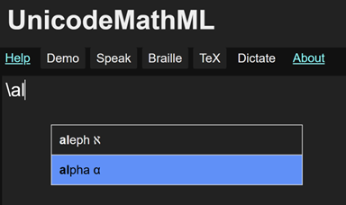
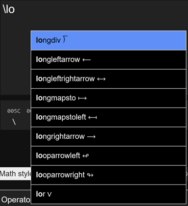
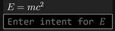
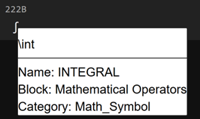
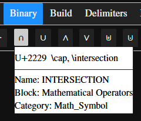

[UnicodeMath](https://www.unicode.org/notes/tn28/UTN28-PlainTextMath-v3.2.pdf) is a linear representation of math that often resembles math notation and is easy to enter.
For example, a/b is UnicodeMath for <math><mrow><mfrac><mi>a</mi><mi>b</mi></mfrac><mo>.</mo></mrow></math>
It works well in Microsoft desktop apps such as Word, PowerPoint, Outlook, and OneNote but it hasn't been generally available elsewhere.
This open-source applet implements UnicodeMath on the web.

## Entering equations
You can enter equations in five ways:
1. Enter UnicodeMath into the input (upper-left) window. The corresponding 2D built-up math displays in the output (upper-right) window and the [MathML](https://w3c.github.io/mathml/) for it displays below the output window. This option is quite reliable.
2. Enter Nemeth braille, [La]TeX, or MathML into the input window. If the input window starts with a Unicode braille character (U+2800..U+28FF), Nemeth ASCII braille input is enabled. If the input starts with $, $$, \\(, or \\[, LaTeX input is enabled. If it starts with <math, MathML input is enabled.
3. Enter UnicodeMath directly into the output window. This option builds up what you enter automatically, similarly to entry in the Microsoft Office apps. This option is a work in progress.
4. Click on the Dictate button or type Alt+d, wait for the bell, and dictate the equation in English. You need to have Internet access, and you need to enunciate clearly. This option is also a work in progress but if you get it to work it’s the fastest entry method except for:
5. Paste MathML into the input or output window.

## See and/or hear it in action
Click on the Demo button or type Alt+p in the input window to see it in action!
Hit the space bar to pause the demo and hit it again to continue the demo.
The arrow keys → and ← move to the next/previous equation, respectively.
Escape and Alt+p stop the demo. One of the equations has the UnicodeMath 1/2𝜋 ∫_0^2𝜋 ⅆ𝜃/(𝑎+𝑏 sin⁡𝜃)=1/√(𝑎²−𝑏²), which builds up to

<math display="block" xmlns="http://www.w3.org/1998/Math/MathML"><mrow><mfrac><mn>1</mn><mrow><mn>2</mn><mi>𝜋</mi></mrow></mfrac><mrow intent=":integral(0,$h,$naryand)"><msubsup><mo>∫</mo><mn>0</mn><mrow arg="h"><mn>2</mn><mi>𝜋</mi></mrow></msubsup><mfrac arg="naryand"><mrow><mi intent="ⅆ">𝑑</mi><mi>𝜃</mi></mrow><mrow><mi>𝑎</mi><mo>+</mo><mi>𝑏</mi><mrow intent=":function"><mi>sin</mi><mo>⁡</mo><mi>𝜃</mi></mrow></mrow></mfrac></mrow><mo>=</mo><mfrac><mn>1</mn><msqrt><mrow><msup><mi>𝑎</mi><mn>2</mn></msup><mo>−</mo><msup><mi>𝑏</mi><mn>2</mn></msup></mrow></msqrt></mfrac></mrow></math>

To speak the equations, type the space bar to pause the demo, type Alt+s to speak the current equation, and then type the right arrow key to advance to the next equation. Alternatively, type Alt+Enter to enter the current Examples equation (and advance the Examples equation ID), and type Alt+s to speak the equation. In these ways, you can cycle through the equations speaking each one.

You can click on an example in the Examples gallery to enter it and the following control words enter the UnicodeMath for selected examples (handy for quick entry on smaller screens):

| Control Word | UnicodeMath    |
| ------------ | --------------------------- |
| \absvalue | \|𝑥\|=Ⓒ("if "𝑥>=&0,&𝑥@"if "𝑥<&0,&-𝑥) |
| \Faraday | 𝛁⨯𝐄=−𝜕𝐁/𝜕𝑡 |
| \Fourier| 𝑓̂(𝜉)=∫_-∞\^∞ 𝑓(𝑥)ⅇ^-2𝜋ⅈ𝑥𝜉 ⅆ𝑥 |
| \integral | 1/2𝜋 ∫_0^2𝜋 ⅆ𝜃/(𝑎+𝑏 sin⁡𝜃)=1/√(𝑎²−𝑏²) |
| \integralG | ∫_-∞\^∞ 𝑒^-𝑥² ⅆ𝑥=√𝜋 |
| \limit | lim_(𝑛→∞) (1+1/𝑛)^𝑛=𝑒 |
| \plasma | 𝑍(𝛾+𝑖𝜔−𝑖𝜈)=𝑖/√𝜋 ∫_−∞^∞ 𝑒\^(−(𝜔−𝜔′)^2 \/(Δ𝜔)^2)/(𝛾+𝑖(𝜔′−𝜈)) ⅆ𝜔′ |
| \quadratic | 𝑥=(−𝑏±√(𝑏²−4𝑎𝑐))/2𝑎 |
| \SHO | 𝑥̈+2𝛾𝑥̇+𝜔²𝑥=0 |
| \waveeq | 𝑖ℏ 𝜕𝜓(𝑥,𝑡)/𝜕𝑡 =[−ℏ²/2𝑚 𝜕²/𝜕𝑥²+𝑉(𝑥,𝑡)]𝜓(𝑥,𝑡) |


## Entering symbols
You can enter a symbol by clicking on the symbol in one of the symbol galleries below the input window.
But it’s faster to type the symbol’s LaTeX control word such as \alpha for α.
After typing two letters, you get a math autocomplete dropdown with possible matches.
This lets you enter the selected symbol (the one highlighted in blue) quickly by typing Enter or Tab.

For example, if you type \al, you see


 
Typing the Enter or Tab key inserts 𝛼.
If you want a different symbol in the dropdown, you can click on it, or you can use the up/down (↑↓) arrow keys to select the symbol you want and type the Enter or Tab key to enter it.

The math autocomplete menu helps you discover a LaTeX control word, and it speeds entry especially for long control words such as those in the dropdown



The symbol dictionary includes some control-word aliases, such as \union for \cup (∪), since you might not guess \cup is the LaTeX control word for the union operator ∪.

## Entering math alphanumerics
Unicode has many math styled characters, such as the math fraktur H (ℌ). They can be entered by selecting the letter(s) in the input or output windows and clicking on the 𝔄𝔅ℭ button or other math-style button. 
You can also enter a character in the Math styles text box and click on the desired math style button.

Or you can enter the control words for the desired characters. The math-style control words consist of a math-style prefix followed by the unstyled character. For example, the prefix "mbf" (math boldface) defines the bold math style and the control word \mbfH gives a bold H, that is, 𝐇. The math-style prefixes are defined in the table

| Math Style | Prefix | Math Style | Prefix |
|-------|--------|---------|---------|
| normal | mup | bold | mbf |
| italic | mit | bold-italic | mbfit |
| double-struck | Bbb | bold-fraktur | mbffrak |
| script | mscr | bold-script | mbfscr |
| fraktur | mfrak | sans-serif | msans |
| bold-sans-serif | mbfsans | sans-serif-italic | mitsans |
| sans-serif-bold-italic | mbfitsans | monospace | mtt |
| chancery | mchan | roundhand | mrhnd |
| isolated | misol | initial | minit |
| tailed | mtail | looped | mloop |
| stretched | mstrc |

Here roundhand and chancery are two script styles, and isolated, initial, tailed, looped, and stretched are Arabic math styles. Currently the Arabic math styles require the XITS Math font and the chancery and roundhand variants require the STIX Two Math font.

## Character code points
Below the input window, there’s a Unicode codepoint window that displays the codepoints of the input symbols above the symbols.
This is particularly useful for comparing two strings that appear to be identical but differ in one or more characters.
Both the input and output windows support the Alt+x symbol entry method popular in Microsoft Word, OneNote, and NotePad.
(It should be supported in all editors 😊).
For example, type 222b Alt+x to insert ∫.

## Speech, braille, LaTeX, dictation
In addition to generating MathML, you can click on buttons or enter a hot key to
* Speak the math in English (Alt+s)
* Braille the math in Nemeth  braille (Alt+b)
* Convert the math to Unicode LaTeX (Alt+t)
* Dictate an equation (Alt+d)
* Display the Help page (Alt+h)
* Display the About page (Alt+a)
* Enter the current Example equation and advance the Example equation ID (Alt+Enter)

The results for speech, braille and LaTeX are displayed below the input window.
Dictation results are shown in the input, output, and MathML windows.
Dictation hint: wait for the start beep (else the first word(s) might be missing) and enunciate clearly.
## Math display
The math is rendered in the output window either natively or by MathJax according to a setting (click on the ⚙︎ to change it).
MathJax’s typography resembles LaTeX’s.
The native rendering is good although not yet as good as LaTeX.
But an advantage of the native renderer is that you can edit built-up equations directly in the output window and copy all or part of an equation.
If the selection is an insertion point, the whole equation is copied.
The only editing feature in the MathJax mode is Ctrl+c, which copies the MathML for the whole equation to the clipboard.
## Navigating the app
A mouse or touchpad provides one way to move between and inside the various facilities. Another way is to use the Tab key. Since the app has myriad default Tab stops, users need a Tab hierarchy. The top of the hierarchy has the menu stops Help, Demo, Speak, Braille, TeX, Dictate, and About, followed by the Input and Output windows, Settings, History, math styles, and the symbol galleries. The galleries appear in alphabetical order, Accents, Arrows, Binary, etc. The Tab key navigates these stops in the forward direction, while Shift+Tab navigates in the backward direction. The Enter key activates the current stop's facility. In an activated facility, the left and right arrow keys move between the facility's options. The Enter key then runs the option. For an active symbol gallery, the Enter key inserts the current symbol. For most settings, the Enter key toggles the current option. For menu stops, the Enter key sends the associated hot key. Each change is accompanied by explanatory speech.
## Intents
UnicodeMathML generates [Presentation MathML 4](https://w3c.github.io/mathml/).
A key addition in MathML 4 is the intent attribute, which allows authors to disambiguate math notation and control math speech.

For example, does |𝑥| mean the absolute value of 𝑥 or the cardinality of 𝑥?
Absolute value is assumed by default since absolute value is more common than cardinality.
The default MathML for |x| is
```html
<mrow intent="absolute-value(𝑥)">
  <mo>|</mo><mi>𝑥</mi><mo>|</mo></mrow>.
```
To specify cardinality, enter \card(x) (or ⓒ(x)).
These inputs produce the MathML
```html
<mrow intent="cardinality(𝑥)">
  <mo>|</mo><mi>𝑥</mi><mo>|</mo></mrow>.
```
If you enter an absolute value or cardinality containing more than one symbol as in |a+b|, the MathML intent contains an argument reference $a.
For |a+b|, the MathML is
```html
<mrow intent="absolute-value($a)">
  <mo>|</mo>
    <mrow arg="a">
      <mi>𝑎</mi><mo>+</mo><mi>𝑏</mi></mrow>
  <mo>|</mo></mrow>
```
A matrix enclosed in vertical bars is treated as a determinant.
For example, the UnicodeMath |■(a&b@c&d)| builds up to

<math display="block"><mrow intent="determinant($a)"><mo>|</mo><mtable arg="a"><mtr><mtd><mi>𝑎</mi></mtd><mtd><mi>𝑏</mi></mtd></mtr><mtr><mtd><mi>𝑐</mi></mtd><mtd><mi>𝑑</mi></mtd></mtr></mtable><mo>|</mo></mrow></math>

which has the MathML
```html
<mrow intent="determinant($a)">
  <mo>|</mo>
    <mtable arg="a">
      <mtr>
        <mtd><mi>𝑎</mi></mtd><mtd><mi>𝑏</mi></mtd></mtr>
      <mtr><mtd><mi>𝑐</mi></mtd><mtd><mi>𝑑</mi></mtd></mtr></mtable>
  <mo>|</mo></mrow>.
```
The program infers intent attributes for absolute value and determinant, so only cardinality needs to be input without vertical bars.
Note that the ambiguous expression |𝑎|𝑏+𝑐|𝑑| is assumed to be (|𝑎|)𝑏+𝑐(|𝑑|).
If you want |𝑎(|𝑏+𝑐|)𝑑|, enter |(𝑎|𝑏+𝑐|𝑑)| and the parentheses will be removed.

As we see here, some intent attribute values are implied by the input notations of LaTeX and UnicodeMath.
Others are implied by context.
Still others must be declared explicitly by the content author, by a math-knowledgeable copy editor, or maybe eventually by AI.
## Author intents
Since most content authors don’t know MathML, we need a way to allow them to enter intents easily.
To this end, UnicodeMathML has an output-window context-menu option that lets you tag entities with intents.
For example, right-clicking on the 𝐸 in 𝐸 = 𝑚𝑐², you get the input box



and you can type in “energy” or whatever you want followed by the Enter key.
If you type in “energy”, the resulting MathML is

```html
<mrow>
  <mi intent="energy">𝐸</mi>
  <mo>=</mo>
  <mrow>
    <mi>𝑚</mi>
    <msup><mi>𝑐</mi>
    <mn>2</mn></msup></mrow></mrow>
```

Typing Atl+d speaks this as "energy equals m c squared".

## UnicodeMath editing
As you type into the input window, various conversions occur in the input window:
* Letters are converted to math italic unless they 1) are part of a function name or of a control word (backslash followed by letters), or 2) follow a quote. For example, a → 𝑎
* Numeric subscripts/superscripts are converted to Unicode subscript/superscript characters, respectively. For example, a_2 → 𝑎₂ and a^2 → 𝑎².
* Numeric fractions are converted to Unicode numeric fractions. For example, 1/2 → ½
* Control words are converted to their symbols, e.g., \alpha → 𝛼

These conversions aren't needed in the input window, but they make the input more readable.
## Editing hot keys:
| Hot key | Function    |
| ------- | ----------- |
| Ctrl+b  | Toggle the bold attribute. For example, select 𝑎 (U+1D44E), type Ctrl+b and get 𝒂 (U+1D482) as you can verify in the codepoint window. |
| Ctrl+c  | Copy the selected text to the clipboard. |
| Alt+h   | Display the help page. |
| Ctrl+i  | Toggle the italic attribute. If applied to a math italic character, this changes the character to the UnicodeMath way of representing ordinary text, i.e., put it inside quotes as in select 𝑎, Ctrl+i → “a”. |
| Alt+m   | Toggle between displaying 1) UnicodeMath in the input window and MathML below the output window, and 2) MathML in the input window and UnicodeMath below the output window. |
| Ctrl+v  | Paste plain text from the clipboard. If the text starts with <math, <m:math, or <mml:math, the text is treated as MathML and builds up. |
| Ctrl+x  | Copy the selected text to the clipboard, then delete the selected text.|
| Ctrl+y  | Redo |
| Ctrl+z  | Undo |
## Symbol galleries
Unicode has [almost all math symbols](https://www.unicode.org/reports/tr25/) in use today.
The symbol galleries located below the input and output windows contain the most common math symbols.
You can enter a symbol in a gallery by clicking on it or by typing its control word as described in the _Entering symbols_ section above.

Most symbols have LaTeX control-word tooltips.
For example, in the codepoint window, hovering over the integral symbol ∫ displays


 
Simlarly, hovering over the ∩ in the Binary operator gallery displays


  
Here \cap is the standard [La]TeX control word for entering ∩ but since \intersection is easier to guess, it’s included too.

## Output window editing
You can enter equations and edit the built-up display in the output window as shown in this video

<video src="help-images/Autobuildup5.mp4" style="display: block;
           margin-left: auto; margin-right: auto;
           width: 90%;" controls/>

This "in-place" editing mimics the [math editing experience](https://devblogs.microsoft.com/math-in-office/officemath/) in desktop Microsoft Word, Outlook, PowerPoint, and OneNote.
The hot keys listed above work here too, as do the symbol galleries and the math autocomplete menus.
The copy hot key, Ctrl+c, copies the MathML for the selected content into the plain-text copy slot, rather than copying the underlying plain text.
This enables you to paste built-up math equations into Word and other apps that interpret "plain-text" MathML as MathML rather than as plain text.
Note: math autobuildup works with native MathML rendering; if MathJax is active, only Ctrl+c works.

Currently arrow-key navigation needs work and there are other glitches.
The implementation uses JavaScript to manipulate the MathML in the browser DOM.

## TeX macros
You can use [La]TeX macros with [La]TeX input. Simple examples are:

| Macro | Use | Result
|-------|------------|-----|
| \def\f{x_1+...+x_n} | \f | 𝑥₁+⋯+𝑥_𝑛 |
| \def\g#1#2\{#1+#2} | \g ab | 𝑎 + 𝑏 |

The last equation in the Examples gallery is LaTeX that defines a macro and then uses it: \\[\def\g#1#2{#1f(#2)}\g\relax{x}=\int_{-\infty}\^\infty \g\hat\xi\,e\^{2 \pi i \xi x} \,d\xi\\]. This displays as

<math display="block" xmlns="http://www.w3.org/1998/Math/MathML"><mi>𝑓</mi><mrow intent=":fenced"><mo>(</mo><mi>𝑥</mi><mo>)</mo></mrow><mo>=</mo><mrow intent=":nary($l,∞,$naryand)"><msubsup><mo>∫</mo><mrow arg="l"><mo>−</mo><mi>∞</mi></mrow><mi>∞</mi></msubsup><mrow arg="naryand"><mover accent="true"><mi>𝑓</mi><mo>̂</mo></mover><mrow intent=":fenced"><mo>(</mo><mi>𝜉</mi><mo>)</mo></mrow><mspace width="thinmathspace"></mspace></mrow></mrow><msup><mi>𝑒</mi><mrow><mn>2</mn><mi>𝜋</mi><mi>𝑖</mi><mi>𝜉</mi><mi>𝑥</mi></mrow></msup><mspace width="thinmathspace"></mspace><mi>𝑑</mi><mi>𝜉</mi></math>

LaTeX \newcommand syntax is also supported.

## UnicodeMath selection attributes
__Technical stuff__:
When you edit the output window, the resulting MathML includes attributes that represent the state of the user selection.
These attributes have been added partly because they are [needed to make editing accessible](https://devblogs.microsoft.com/math-in-office/mathml-and-omml-user-selection-attributes/).
The attribute "selanchor" defines the selection "anchor" end (the nonmoving end) and "selfocus" defines the selection active end, e.g., the end that moves with Shift+→.
The attribute values define the offsets for the selection [setBaseAndExtent](https://developer.mozilla.org/en-US/docs/Web/API/Selection/setBaseAndExtent) method.
If the selection is an insertion point (a degenerate selection), only selanchor is included since the anchor and focus ends coincide.

Corresponding constructs have been added to UnicodeMath to represent the selection state.
They are needed for the multilevel undo facility, which saves back states by caching the back-state UnicodeMath strings.
The enclosure Ⓐ(_offset_) defines the position of the selection _anchor_ and the enclosure Ⓕ(_offset_) defines the position of the selection _focus_.
If no _offset_ appears, 0 is assumed.
To increase readability, these enclosures are not included in the UnicodeMath displayed in the input window.
Nondegenerate selections have the focus enclosure as well, as in the UnicodeMath "Ⓐ()Ⓕ(1)⬚" for the selected "⬚".

A negative offset is used if the selection construct refers to a text node.
The absolute value of a negative offset gives the offset into a string.
For example, &lt;mi selanchor="-1">sin&lt;/mi> sets the anchor to the "i" in "sin".
Positive attribute values give the index of a child element.
So, &lt;mi selanchor="1">sin&lt;/mi> places the anchor immediately following "sin".

